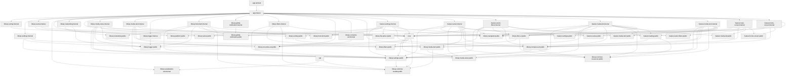

# Module Graph

```mermaid
%%{
  init: {
    'theme': 'neutral'
  }
}%%

graph TB
    :app:android[":app:android"]
    :app:shared[":app:shared"]
    :feature:home-screen:internal[":feature:home-screen:internal"]
    :feature:home-screen:public[":feature:home-screen:public"]
    :feature:loading:public[":feature:loading:public"]
    :feature:main-screen:internal[":feature:main-screen:internal"]
    :feature:media-item:internal[":feature:media-item:internal"]
    :feature:media-item:public[":feature:media-item:public"]
    :feature:media-list:internal[":feature:media-list:internal"]
    :feature:media-list:public[":feature:media-list:public"]
    :feature:select-filters:internal[":feature:select-filters:internal"]
    :feature:select-filters:public[":feature:select-filters:public"]
    :feature:series:internal[":feature:series:internal"]
    :feature:series:public[":feature:series:public"]
    :feature:settings:internal[":feature:settings:internal"]
    :feature:settings:public[":feature:settings:public"]
    :library:common-models:public[":library:common-models:public"]
    :library:common-resources:public[":library:common-resources:public"]
    :library:compose-ext:public[":library:compose-ext:public"]
    :library:coroutine-ext:internal[":library:coroutine-ext:internal"]
    :library:coroutine-ext:public[":library:coroutine-ext:public"]
    :library:file-picker:public[":library:file-picker:public"]
    :library:filter-ui:public[":library:filter-ui:public"]
    :library:filters:internal[":library:filters:internal"]
    :library:filters:public[":library:filters:public"]
    :library:global-notification:internal[":library:global-notification:internal"]
    :library:global-notification:public[":library:global-notification:public"]
    :library:holoclient:internal[":library:holoclient:internal"]
    :library:holoclient:public[":library:holoclient:public"]
    :library:logger:internal[":library:logger:internal"]
    :library:logger:public[":library:logger:public"]
    :library:media-item:internal[":library:media-item:internal"]
    :library:media-item:public[":library:media-item:public"]
    :library:media-notes:internal[":library:media-notes:internal"]
    :library:media-notes:public[":library:media-notes:public"]
    :library:navigation:public[":library:navigation:public"]
    :library:networking:internal[":library:networking:internal"]
    :library:networking:public[":library:networking:public"]
    :library:platform:public[":library:platform:public"]
    :library:serialization-ext:internal[":library:serialization-ext:internal"]
    :library:series:internal[":library:series:internal"]
    :library:series:public[":library:series:public"]
    :library:settings:internal[":library:settings:internal"]
    :library:settings:public[":library:settings:public"]
    :library:sorting:internal[":library:sorting:internal"]
    :library:sorting:public[":library:sorting:public"]
    
    :api --> :library:common-models:public
    :api --> :library:serialization-ext:internal
    :app:android --> :app:shared
    :app:shared --> :core
    :app:shared --> :feature:home-screen:internal
    :app:shared --> :feature:main-screen:internal
    :app:shared --> :feature:media-item:internal
    :app:shared --> :feature:media-list:internal
    :app:shared --> :feature:select-filters:internal
    :app:shared --> :feature:series:internal
    :app:shared --> :feature:settings:internal
    :app:shared --> :library:compose-ext:public
    :app:shared --> :library:coroutine-ext:internal
    :app:shared --> :library:coroutine-ext:public
    :app:shared --> :library:filters:internal
    :app:shared --> :library:global-notification:internal
    :app:shared --> :library:holoclient:internal
    :app:shared --> :library:logger:internal
    :app:shared --> :library:media-item:internal
    :app:shared --> :library:media-notes:internal
    :app:shared --> :library:navigation:public
    :app:shared --> :library:networking:internal
    :app:shared --> :library:platform:public
    :app:shared --> :library:serialization-ext:internal
    :app:shared --> :library:series:internal
    :app:shared --> :library:settings:internal
    :app:shared --> :library:sorting:internal
    :core --> :library:common-models:public
    :core --> :library:coroutine-ext:public
    :core --> :library:filters:public
    :core --> :library:logger:public
    :core --> :library:media-notes:public
    :core --> :library:settings:public
    :feature:home-screen:internal --> :feature:home-screen:public
    :feature:home-screen:internal --> :library:compose-ext:public
    :feature:home-screen:internal --> :library:navigation:public
    :feature:loading:public --> :library:common-resources:public
    :feature:loading:public --> :library:compose-ext:public
    :feature:main-screen:internal --> :feature:home-screen:public
    :feature:main-screen:internal --> :feature:media-list:public
    :feature:main-screen:internal --> :feature:select-filters:public
    :feature:main-screen:internal --> :feature:settings:public
    :feature:main-screen:internal --> :library:compose-ext:public
    :feature:main-screen:internal --> :library:navigation:public
    :feature:media-item:internal --> :core
    :feature:media-item:internal --> :feature:loading:public
    :feature:media-item:internal --> :feature:media-item:public
    :feature:media-item:internal --> :feature:series:public
    :feature:media-item:internal --> :library:common-resources:public
    :feature:media-item:internal --> :library:compose-ext:public
    :feature:media-item:internal --> :library:media-item:public
    :feature:media-item:internal --> :library:media-notes:public
    :feature:media-item:internal --> :library:navigation:public
    :feature:media-item:internal --> :library:settings:public
    :feature:media-list:internal --> :core
    :feature:media-list:internal --> :feature:loading:public
    :feature:media-list:internal --> :feature:media-item:public
    :feature:media-list:internal --> :feature:media-list:public
    :feature:media-list:internal --> :library:common-resources:public
    :feature:media-list:internal --> :library:compose-ext:public
    :feature:media-list:internal --> :library:filter-ui:public
    :feature:media-list:internal --> :library:media-item:public
    :feature:media-list:internal --> :library:media-notes:public
    :feature:media-list:internal --> :library:navigation:public
    :feature:media-list:internal --> :library:settings:public
    :feature:media-list:internal --> :library:sorting:public
    :feature:select-filters:internal --> :feature:loading:public
    :feature:select-filters:internal --> :feature:select-filters:public
    :feature:select-filters:internal --> :library:compose-ext:public
    :feature:select-filters:internal --> :library:filter-ui:public
    :feature:select-filters:internal --> :library:filters:public
    :feature:select-filters:internal --> :library:navigation:public
    :feature:select-filters:internal --> :library:settings:public
    :feature:series:internal --> :core
    :feature:series:internal --> :feature:media-item:public
    :feature:series:internal --> :feature:series:public
    :feature:series:internal --> :library:common-resources:public
    :feature:series:internal --> :library:compose-ext:public
    :feature:series:internal --> :library:media-item:public
    :feature:series:internal --> :library:media-notes:public
    :feature:series:internal --> :library:navigation:public
    :feature:series:internal --> :library:series:public
    :feature:series:internal --> :library:settings:public
    :feature:settings:internal --> :core
    :feature:settings:internal --> :feature:settings:public
    :feature:settings:internal --> :library:compose-ext:public
    :feature:settings:internal --> :library:file-picker:public
    :feature:settings:internal --> :library:global-notification:public
    :feature:settings:internal --> :library:holoclient:public
    :feature:settings:internal --> :library:navigation:public
    :feature:settings:internal --> :library:platform:public
    :feature:settings:internal --> :library:settings:public
    :library:compose-ext:public --> :library:common-resources:public
    :library:compose-ext:public --> :library:settings:public
    :library:coroutine-ext:internal --> :library:coroutine-ext:public
    :library:filter-ui:public --> :library:common-resources:public
    :library:filter-ui:public --> :library:filters:public
    :library:filters:internal --> :core
    :library:filters:internal --> :library:common-models:public
    :library:filters:internal --> :library:filters:public
    :library:filters:internal --> :library:settings:public
    :library:global-notification:internal --> :library:global-notification:public
    :library:holoclient:internal --> :core
    :library:holoclient:internal --> :library:common-models:public
    :library:holoclient:internal --> :library:global-notification:public
    :library:holoclient:internal --> :library:holoclient:public
    :library:holoclient:internal --> :library:logger:public
    :library:holoclient:internal --> :library:networking:public
    :library:holoclient:internal --> :library:settings:public
    :library:logger:internal --> :library:logger:public
    :library:media-item:internal --> :core
    :library:media-item:internal --> :library:coroutine-ext:public
    :library:media-item:internal --> :library:media-item:public
    :library:media-item:internal --> :library:settings:public
    :library:media-item:public --> :library:common-models:public
    :library:media-item:public --> :library:media-notes:public
    :library:media-notes:internal --> :core
    :library:media-notes:internal --> :library:coroutine-ext:public
    :library:media-notes:internal --> :library:global-notification:public
    :library:media-notes:internal --> :library:logger:public
    :library:media-notes:internal --> :library:media-notes:public
    :library:media-notes:internal --> :library:settings:public
    :library:networking:internal --> :library:logger:public
    :library:networking:internal --> :library:networking:public
    :library:series:internal --> :core
    :library:series:internal --> :library:series:public
    :library:settings:internal --> :library:filters:public
    :library:settings:internal --> :library:logger:public
    :library:settings:internal --> :library:settings:public
    :library:settings:public --> :library:common-models:public
    :library:sorting:internal --> :library:sorting:public
    :library:sorting:public --> :library:media-item:public
```